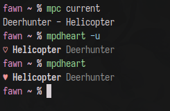

# mpdheart

spread love around your library ♡



## Installation

<!-- ### Arch -->

<!-- ``` -->
<!-- TODO -->
<!-- ``` -->

### crates.io

```
cargo install mpdheart
```

## Usage

to love the currently playing track:

```
mpdheart
```

to unlove:

```
mpdheart -u
```

to get the love status:

```
mpdheart -s
```

## Configuration

mpdheart can be configured by editing the configuration file at `~/.config/mpdheart/config.toml` or `$XDG_CONFIG_HOME/mpdheart/config.toml`

if the config is not found, it will attempt to write an empty config in that path, you need to at least edit the last.fm username and password to be able to un/love tracks

after the first _successful_ run, the config will be lossly rewritten to add the last.fm session key, this means any comments will be lost. this only happens once

### Example

```toml
[mpd] # optional, uses default mpd values if not specified
host = "0.0.0.0"
port = 6600

[lastfm] # after the first run, there will be an additional generated key `session_key`
username = "nya" # required
password = "awa" # required
```

can also be found at [config/example.toml](config/example.toml)

## License

[Apache-2.0](LICENSE)
